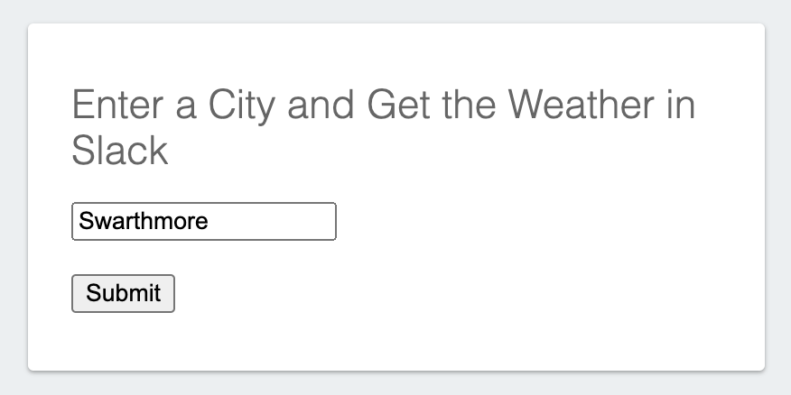
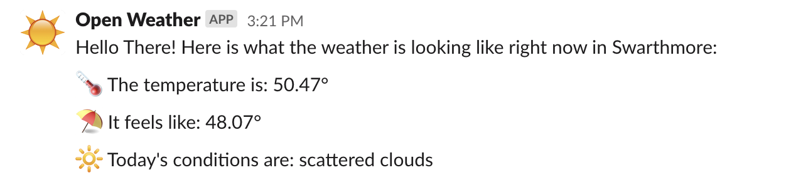
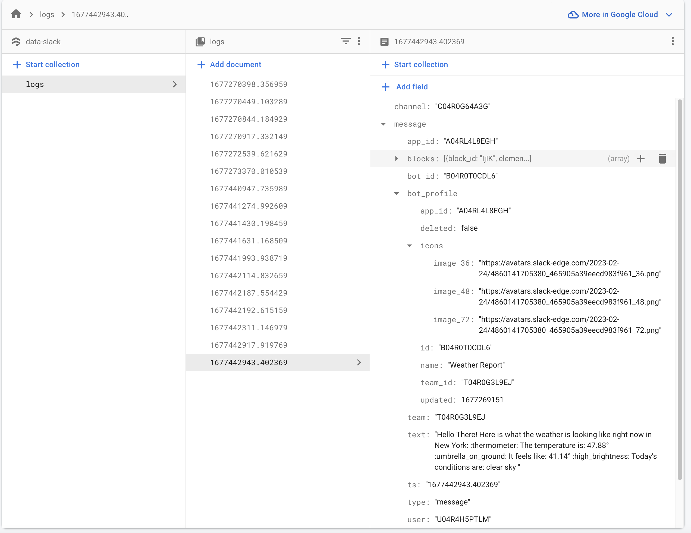

# Data-Slack

# Intro

This application pulls data from the **OpenWeather API** and pushes results to Slack. It is split into two components. The first is a **callable API**, and the second is a **front end** which can make requests to the API. On the front end, users can input cities, and the resulting weather conditions will be sent in a formatted message to a Slack channel. Furthermore, each request is stored in its entirety as a document in **Firebase's Cloud Firestore**.

# Rational and System

The system set up is relatively simple, lightweight, highly adaptable, and can be easily configured to make use of any API. This project utilizes Firebase Cloud Functions and Firebase Firestore Database. These solutions are low cost, easy to setup and configure, and provide many prebuilt packages which we can leverage. On the flip side, Cloud Functions operate on a serverless architecture, and with increasingly advanced projects can have high latency and/or start times. Cloud Functions are relatively inefficient on their first invocation, but repeated calls are noticeably better. The general system is what follows:

> Prelim. ***User goes to https://data-slack.web.app***  
> 1. ***Front end user inputs city, such as New York, and presses "submit"***  
> 2. ***Fetch request sent to API (essentially an API call)***  
> 3. ***API reads query param info, and sends get request to OpenWeather API***  
> 4. ***Response is retrived, formated, and data is sent to Slack channel***  
> 5. ***Result of push to Slack is stored in its entierety in Firebase Firestore document***  
> 6. ***Additionally, the OpenWeather result is pushed as response via API***

# Example Screenshots:

